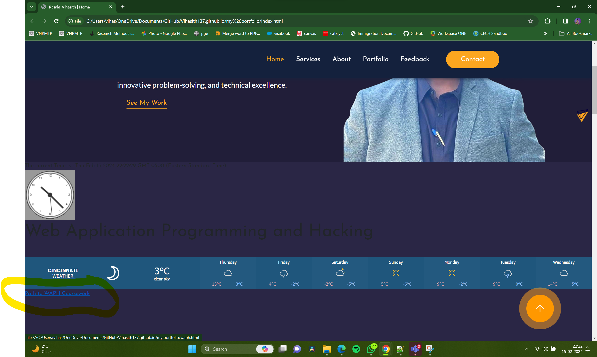
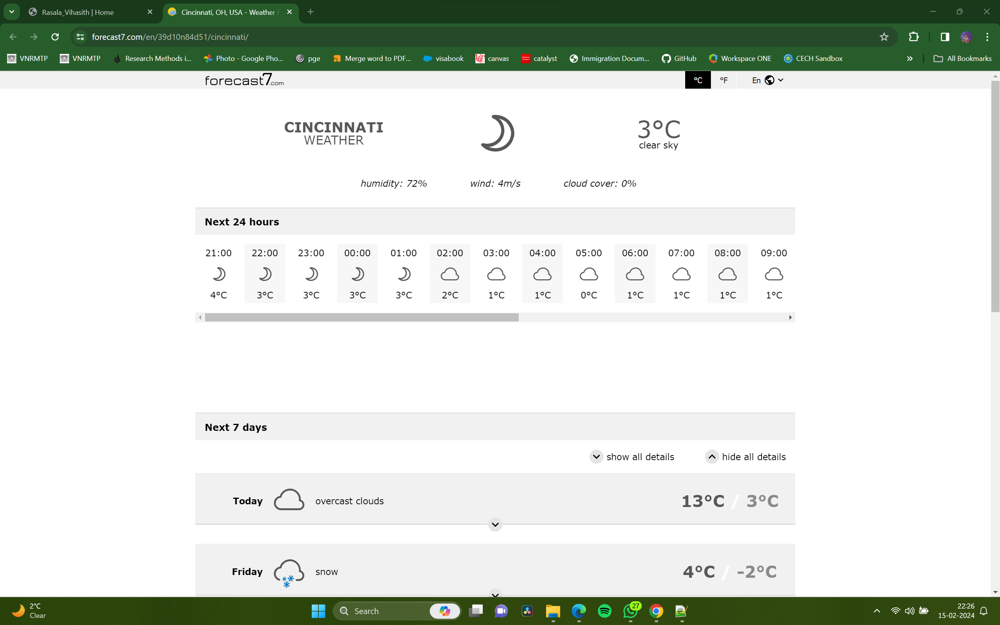
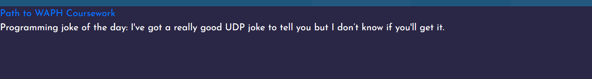

# WAPH-Web Application Programming and Hacking

## Instructor: Dr. Phu Phung

## Student

**Name**: Vihasith Rasala

**Email**: rasalavh@mail.uc.edu


## Individual Project 1 – Front-end Web Development with a Professional Profile Website on github.io cloud service

**Overview**: This project involves creating a professional profile website for front-end web development using GitHub Pages. The personal portfolio has been developed and deployed on GitHub's cloud service.

To meet technical requirements, the website incorporates basic JavaScript, JQuery, and the React library. Additionally, two public web APIs are integrated to enhance functionality. JavaScript cookies are utilized for remembering users, enabling personalized greetings upon revisiting the website.

For non-technical requirements, an open-source Bootstrap framework is utilized to ensure a responsive and visually appealing design. Moreover, Google Analytics page tracker is integrated to gather insights on website traffic and visitor behavior.

Link to the repository:
[https://github.com/Vihasith137/Vihasith137.github.io/blob/main/README.md](https://github.com/Vihasith137/Vihasith137.github.io/blob/main/README.md)

\pagebreak

To create the personal portfolio i have downloaded a predefined bootstrap template from [https://startbootstrap.com/theme/resume](https://startbootstrap.com/theme/resume) and customized it as per the project requirements. This portifolio consists of professional profile with my resume, including name, headshot, contact information, background, e.g., education, my experiences and skills. Additonally, a link to new HTML page to show case the Hackathons , Labs which are completed as part of WAPH course work has been added.





\pagebreak

A live weather update API is added to my portfolio.

```
<div class="weather-widget">
		<a class="weatherwidget-io" href="https://forecast7.com/en/39d10n84d51/cincinnati/" data-label_1="CINCINNATI" data-label_2="WEATHER" data-theme="original" >Weather Forecast</a>
		<script>
		!function(d,s,id){var js,fjs=d.getElementsByTagName(s)[0];
		if(!d.getElementById(id)){js=d.createElement(s);js.id=id;
		js.src='https://weatherwidget.io/js/widget.min.js';
		fjs.parentNode.insertBefore(js,fjs);}}(document,'script','weatherwidget-io-js');
```


An opensource Joke API is added which refreshes for every 60 seconds

~~~
function displayJoke(){
		$.get("https://v2.jokeapi.dev/joke/Programming?type=single",function(result){
				console.log("from joke API: "+ JSON.stringify(result));
				if (result && result.joke) {
				$("#response").text("Programming joke of the day: " +result.joke);
				}
				else{
				 $("#response").text("Could not retrieve a joke at this time.");	
				}
			});
		}
		displayJoke();
		setInterval(displayJoke,60*1000);
~~~

\pagebreak

The techstack used for this portfolio is HTML, CSS, Bootstrap framwork, and JavaScript.

Moreover some of the code from lab 2
<<<<<<< Updated upstream
To make the portfolio interesting i have add a custom greeting message using react. This code helps in greeting the user Good Morning , Good evening , Good afternoon based on the time of the day.
=======
To make the portfolio interesting i have add a custom greeting message using react. This code helps in greeting the user Good Morning , Good evening , Good afternoon based on the time of the day.
>>>>>>> Stashed changes
